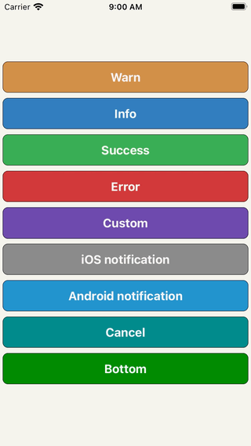

# react-native-dropdownalert

[](https://reactnative.dev)
[](https://www.npmjs.com/package/react-native-dropdownalert)
[](https://www.npmjs.com/package/react-native-dropdownalert)
[](https://raw.github.com/testshallpass/react-native-dropdownalert/master/LICENSE)
[](https://github.com/testshallpass/react-native-dropdownalert/actions/workflows/ci.yml)



## Table of contents

- [Installation](#installation)
- [Usage](#usage)
- [Support](#support)
- [Using children prop](#using-children-prop)
- [Caveats](#caveats)
- [More Examples](./example/App.tsx)

An alert to notify users about an error or something else. It can be dismissed by press, cancel, automatic, pan gesture or programmatic. It can be customized and/or you can build your own alert (BYOA) - see [DropdownAlertProps](./DropdownAlert.tsx) on what's available.

## Installation

- `yarn add react-native-dropdownalert`
- `npm i react-native-dropdownalert --save`

## Usage

import the library

```javascript
import DropdownAlert, {
  DropdownAlertData,
  DropdownAlertType,
} from 'react-native-dropdownalert';
```

create an alert promise function variable

```javascript
let alert = (_data: DropdownAlertData) => new Promise<DropdownAlertData>(res => res);
```

add the component as the last component in the document tree so it overlaps other UI components and set alert prop with alert function

```javascript
<DropdownAlert alert={func => (alert = func)} />
```

invoke alert

```javascript
const alertData = await alert({
  type: DropdownAlertType.Error,
  title: 'Error',
  message: 'Something went wrong.',
});
```

## Support

| react minium version | react-native minium version | package version | reason              |
| :------------------: | :-------------------------: | :-------------: | ------------------- |
|       v16.8.0        |           v0.61.0           |     v5.0.0      | use react hooks     |
|       v16.0.0        |           v0.50.0           |     v3.2.0      | use `SafeAreaView`  |
|   v16.0.0-alpha.6    |           v0.44.0           |     v2.12.0     | use `ViewPropTypes` |

## Using `children` prop

Option 1 pass child component(s) like so:

```javascript
<DropdownAlert>{/* insert child component(s) */}</DropdownAlert>
```

Option 2 pass child component(s) like so:

```javascript
<DropdownAlert children={/* insert child component(s) */} />
```

Either way `DropdownAlert` will render these instead of the pre-defined child components when alert is invoked. Check out the iOS and Android notifications in example project.

## Caveats

- Modals can overlap `DropdownAlert`` if it is not inside the modal's document tree.
- It is important you place the `DropdownAlert` below the `StackNavigator`.

> Inspired by: [RKDropdownAlert](https://github.com/cwRichardKim/RKDropdownAlert)
